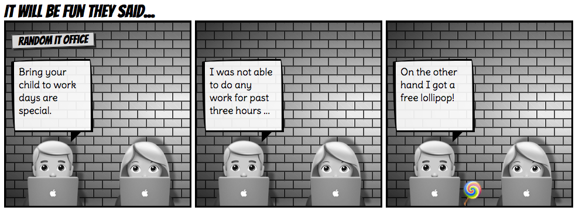

# Gradient company

 - [Production app](https://gradient-company.herokuapp.com/)
 - [Webtoon](http://www.webtoons.com/en/challenge/gradient-company/list?title_no=155642)

## Motivation

1. Over time I collected a lot of stories from my IT friends. Jokes from the environment of big corporates and/or startups. I thought that it would be neat to collect them as a comic. Unfortunately I haven't found easy way to create and download for publishing my ideas (for free). So why not create your own?
1. This is a simple example of **React** in action - a learning project.
1. Very nice showcase of latest & greatest **CSS** features.
1. Also this was not obvious from the start, but I'm creating first ever fully **accessible** comics. It is possible to do virtually infinite zoom without losing quality. Also text readers works very well. And there is possibility to enable high contrast mode as well.
1. Did you know that it's quite a pain to **translate** comics? Well, over here it's quite easy.
1. It is quite challenging to create story with the limited set of tools - CSS &and; some emoji.
1. There are emojis expressing feelings via emojis. How deep can we go?
1. I wanted to create first ever comics that accepts **pull requests**. See a spelling error? Want to address discriminative language? Have idea for new episode? Comics is broken on your browser? Raise a PR!

## Technicalities 

This project was bootstrapped with [Create React App](https://github.com/facebookincubator/create-react-app).

### Development

`yarn start`

### Contributing 

This project is very immature. Learning process. If you'd like to help, raise a PR, create an issue or just [give me a shout](https://twitter.com/MichalBryxi). I have quite a few ideas in my head about enhancements.